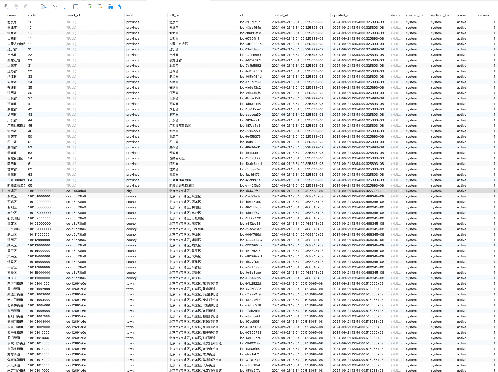

> 2023年统计用区划代码和城乡划分代码 (五级分类) 数据

>For study use only!
```bash
# data source
https://www.stats.gov.cn/sj/tjbz/tjyqhdmhcxhfdm/2023/
```

```bash
# depend
sudo apt-get update && sudo apt-get install postgresql
pip install -r requirements.txt -i https://mirrors.aliyun.com/pypi/simple/
```

```bash
# get area data
python get_area_data.py
```

<p>
  
</p>